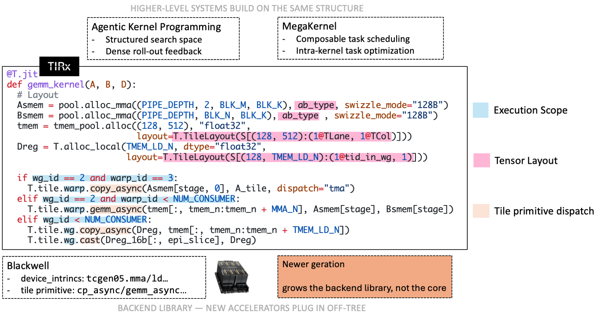
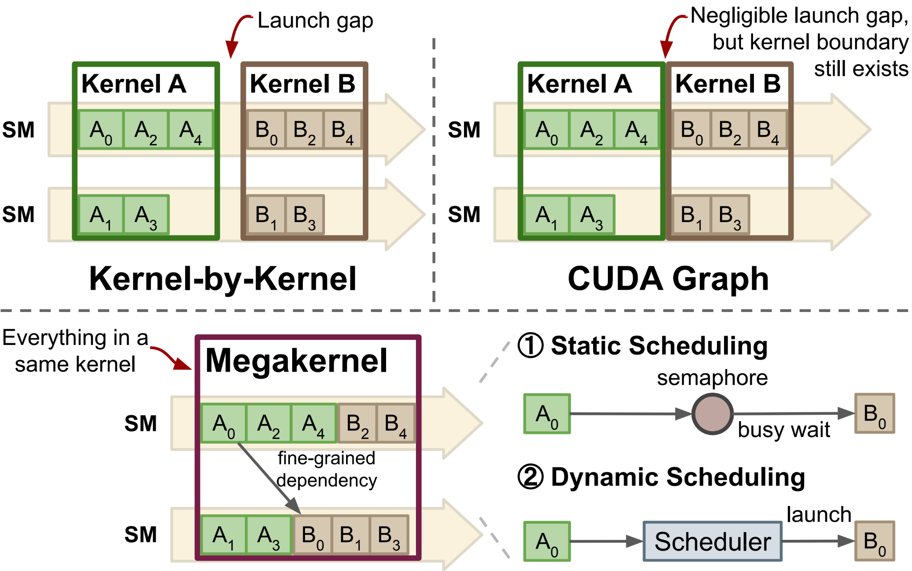
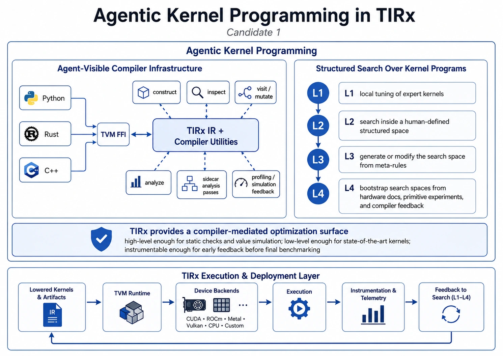

<!-- source: https://tvm.apache.org/docs/tirx/overview.html -->

# Overview

TIRx (pronounced *“tier-ex”*) is an open-source, hardware-native DSL and compiler
for machine-learning kernels. It targets the part of the AI software stack
where fast-moving kernels meet fast-moving hardware: TIRx compiles to GPUs and
specialized AI accelerators today and is designed to grow with the hardware
generations that follow. The same design makes it a substrate not only for
expert-written kernels, but also for agent-generated kernels and megakernel
systems.

TIRx is the next-generation kernel-level compiler structure of Apache TVM, and
is built on top of the TVM compiler infrastructure.

A TIRx kernel keeps orchestration — pipeline state, roles, synchronization,
and backend intrinsics — in hardware-native source, while execution scope,
tensor layout, and tile primitive dispatch expose the recurring tile
structure to the compiler. Higher-level systems build on the same structure.

## Design Philosophy

Kernel DSLs are most effective when they choose the right boundary between the
programmer and the machine. For mature kernels on mature hardware, that boundary
can be high-level: the compiler hides thread assignment, memory movement, layout
details, and instruction selection behind compact tensor or tile abstractions,
and this works well for established kernel patterns.

At the frontier, the same boundary is under more pressure. New instructions,
memory spaces, cooperation patterns, and kernel algorithms often appear *before*
a compiler has enough built-in machinery to automate them well.

TIRx chooses a **lower and more explicit boundary**. It keeps the parts of a
kernel that frequently require expert control — pipeline structure,
synchronization, role assignment, memory placement, and backend intrinsics — in
hardware-native source code. At the same time, it exposes the recurring tile-level
structure to the compiler through three constructs: *execution scope*, *tensor
layout*, and *tile primitive dispatch*. Orchestration stays in hardware-native
source code, while the recurring tile-level structure becomes visible to the
compiler. Hardware-native control is powerful but costs engineering effort;
exposing recurring operations as tile primitives relieves this, since authors
reuse a dispatched implementation instead of re-writing the same operation for
each kernel and backend.

The result is a DSL that can **grow with the hardware**. A new feature can first
be used directly as a native intrinsic, and later become a reusable primitive
once the pattern stabilizes. This is the core design philosophy behind TIRx:
keep the foundation small and explicit, and let the backend library evolve as
new accelerator generations arrive.

## The Programming Model

A TIRx program reads as a structured native kernel: loops, branches, buffers,
synchronization, pipeline state, backend intrinsics, and hardware roles are
written directly. Tile primitives appear exactly where a repeated hardware-level
operation should become reusable and dispatchable.

The model has three core ingredients.

### Execution scope

Execution scope describes both the active participants and the logical scope of
a primitive invocation. Control flow such as `if wg_id == ...`,
`warp_id == ...`, or `cbx == ...` selects which hardware roles enter a
region, while predicates such as `T.ptx.elect_sync()` further select the
issuing thread.

The primitive namespace is also part of the scope. For example, `Tx.wg.*`
denotes warpgroup-level primitives, while an unqualified `Tx.*` call defaults
to thread-level invocation.

### Tensor layout

Tensor layout, with a storage-first interface, describes how logical
tensors map to physical resources. A tile may live in global memory, shared
memory, registers, tensor memory, or accelerator SRAM.
Users declare where each tile lives and how its elements are spread across
lanes, warps, and registers; tile primitive dispatch reads those declarations to
choose an implementation. A layout is a storage description, not a
loop-transformation utility: users may construct a tile’s layout, but never use
layouts to transform loops.

> **See also**
>
> The layout model — including the shard / replica / offset structure and its
> design rationale — is described in [Tensor Layout](tirx_layout.md), which also has an
> interactive explorer.

### Tile primitive dispatch

Tile primitive dispatch selects an implementation according to the primitive,
the current execution scope, the operand layouts, and the target backend. For
example:

- A `copy` primitive may dispatch to TMA, vectorized loads/stores,
  tensor-memory movement, accelerator DMA, or another backend-specific
  implementation.
- A matrix-multiply primitive may dispatch to WGMMA, `tcgen05`, a
  systolic-array instruction, or a backend-specific matmul engine.

Once a variant is selected, dispatch generates the loops and addressing to
apply that instruction across the whole tile.

### Putting it together

Across a full kernel, orchestration stays in ordinary source code, and the
recurring hardware operations appear as tile primitives. For the building blocks —
TMA loads, `tcgen05` async MMA, reductions, and the rest — see the per-dispatch
walkthroughs in [Tile Primitives](tirx_tile_primitives.md).

## What TIRx Enables

TIRx is immediately useful as a kernel DSL. The same structure also helps with
three things that are becoming important for ML systems: supporting new
hardware, building megakernels, and agentic kernel programming.

### A stable extension boundary for future hardware

New hardware support is a staged process rather than a redesign of the DSL: a
feature is first exposed as a backend intrinsic, then promoted into a tile
primitive once the usage pattern repeats. Future hardware grows the backend
library, not the core language.

### Megakernels and composable tile tasks

Because TIRx tasks exist as compiler IR rather than separately compiled kernels,
a megakernel compiler can stitch and schedule them directly — re-offsetting
shared memory, renaming barriers, reassigning warp roles, and interleaving
pipelines across tasks.

From kernel-by-kernel launches to a single megakernel: fusing tasks into one
kernel exposes fine-grained dependencies and in-kernel (static or dynamic)
scheduling.

### Agentic kernel programming

TIRx exposes its IR and compiler utilities through TVM FFI across Python, C++,
and Rust, and offers a structured search space with dense, pre-benchmark
feedback (well-formedness, synchronization validity, race-freedom, value
simulation).

Agent-visible compiler infrastructure (IR and utilities over TVM FFI) plus a
structured search space (levels L1–L4) make TIRx a compiler-mediated
optimization surface for agents.

## Next Steps

- [Installation](tirx_install.md) — install TIRx and the kernel library.
- [Tensor Layout](tirx_layout.md) — the tensor layout model with an interactive explorer.
- [Compiler Internals](tirx_arch_index.md) — compiler internals (lowering pipeline, passes, codegen).
- [API Reference](tirx_api_index.md) — the `tvm.tirx` Python API.
